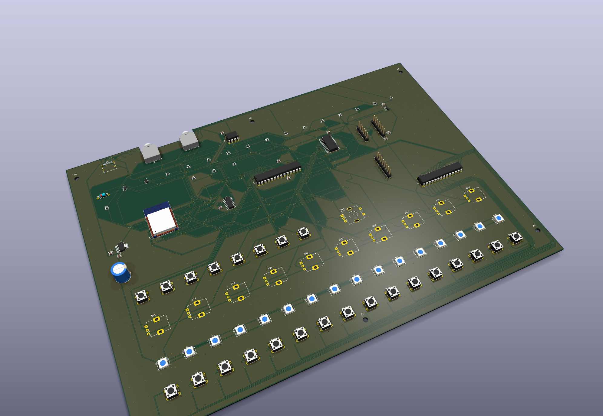
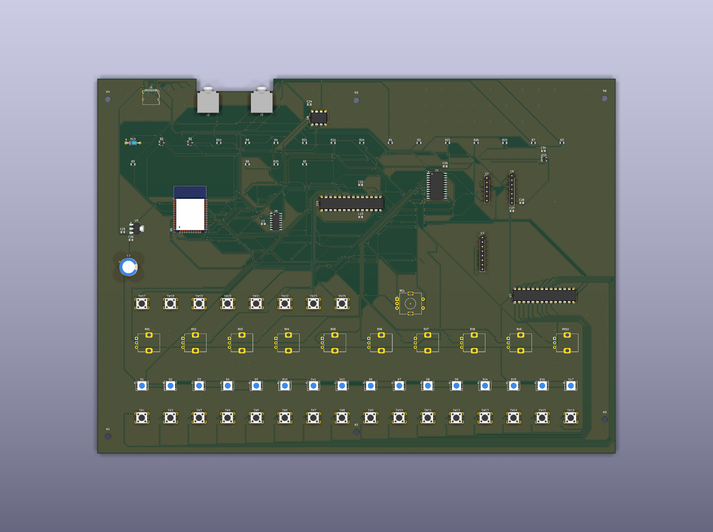
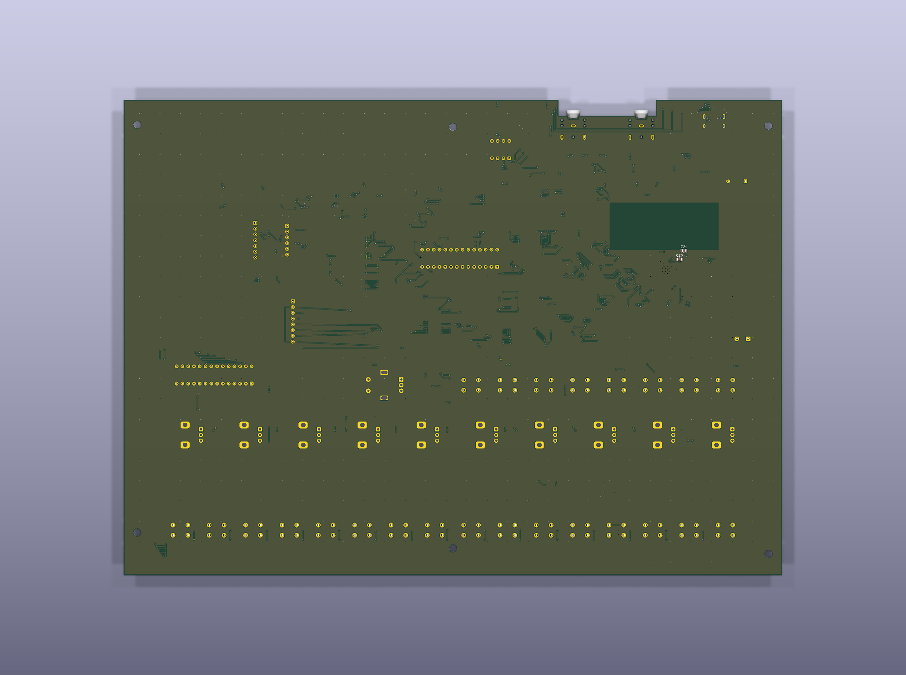
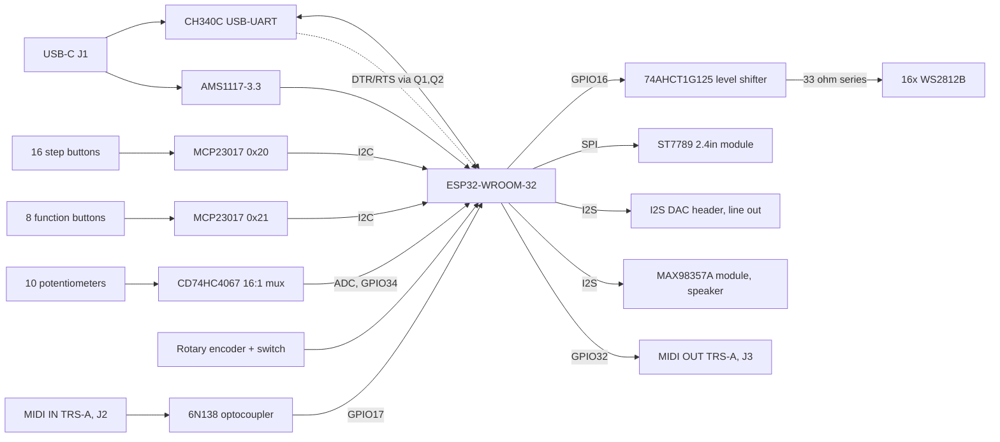

# T-8 Groovebox

A 16-step hardware groovebox built around an ESP32-WROOM-32, designed from scratch in KiCad 10. Two copper layers, 290 × 210 mm, DRC-clean and fabrication-ready.

> **Status: designed, not yet fabricated.**
> The layout passes DRC with **0 errors and 0 unconnected nets**, and the Gerber + drill package in [`fab/`](fab/) has been generated and checked. No board has been ordered yet, so nothing here has been measured on real hardware. Every performance figure in this README is a design intent, not a measurement.



---

## What it is

A desktop groovebox in the spirit of the Roland T-8: sixteen step buttons with per-step RGB feedback, ten pots for live parameter control, a rotary encoder for menu navigation, a 2.4" colour display, MIDI in and out over TRS-A, and two independent audio outputs — a line-level I²S DAC and a class-D amplifier for a small onboard speaker. The whole thing is powered and programmed over a single USB-C connector.

The interesting part of this project is not the feature list, it is that the panel layout and most of the routing were **generated and repaired with the KiCad Python API** rather than drawn by hand. See [How the board was built](#how-the-board-was-built).

## Board at a glance

| | |
|---|---|
| Outline | 290.1 × 210.1 mm, with a 7 mm notch for the MIDI jacks |
| Copper layers | 2 (F.Cu / B.Cu), 1 oz |
| Footprints | 104 |
| Pads | 523 |
| Nets | 137 |
| Tracks | 2,570 segments |
| Vias | 1,148 (0.6 mm pad / 0.3 mm drill) |
| Copper zones | 1 GND plane, poured on both layers |
| Min track / clearance | 0.20 mm / 0.20 mm |
| Min drill | 0.30 mm |
| Min copper-to-edge | 0.50 mm |
| Mounting | 6 × M3 (3.2 mm) |
| DRC | 0 errors, 0 unconnected, 12 cosmetic silkscreen warnings |

### Renders

| Top | Bottom |
|---|---|
|  |  |

Vector fabrication views: [top](img/t8_2d_top.svg) · [bottom](img/t8_2d_bottom.svg)

PDFs: [schematic](T8Sequencer_esquematico.pdf) · [PCB](T8Sequencer_pcb.pdf)

---

## Signal chain



---

## Hardware

### Controls and indicators

| Qty | Part | Role |
|---|---|---|
| 16 | 6 mm tact switch | Step buttons (SW1–SW16) |
| 8 | 6 mm tact switch | PLAY, REC, SHIFT, PATT, TEMPO, CLEAR, F1, F2 (SW17–SW24) |
| 10 | Alps RK09K vertical | Parameter pots (RV1–RV10) |
| 1 | Alps EC11E + switch | Menu encoder |
| 16 | WS2812B (PLCC-4, 5×5 mm) | Per-step RGB feedback |
| 1 | ST7789 2.4" module | Display, on an 8-pin 2.54 mm header |

### Active devices

| Ref | Part | Package | Role |
|---|---|---|---|
| U1 | ESP32-WROOM-32 | module | Main MCU |
| U2 | — | 1×06 header | I²S DAC module, line out |
| U3 | ST7789 2.4" | 1×08 header | Display |
| U4 | CD74HC4067M | SOIC-24W | 16:1 analog mux for the pots |
| U5 | AMS1117-3.3 | SOT-223 | 3.3 V linear regulator |
| U6 | CH340C | SOIC-16 | USB to serial |
| U7 | MCP23017 | DIP-28 | I/O expander, step buttons (0x20) |
| U8 | 6N138 | DIP-8 | MIDI IN isolation |
| U9 | MAX98357A | 1×07 header | Class-D amp module, speaker out |
| U10 | MCP23017 | DIP-28 | I/O expander, function buttons (0x21) |
| U11 | 74AHCT1G125 | SOT-23-5 | 3.3 V to 5 V buffer for the LED data line |
| Q1, Q2 | NPN | SOT-23 | Auto-reset (DTR/RTS to EN/IO0) |

### Connectors

| Ref | Connector | Notes |
|---|---|---|
| J1 | USB-C receptacle, USB 2.0 14P | Power + programming, with 5.1 kΩ CC pulldowns |
| J2 | 3.5 mm TRS | MIDI IN, **TRS-A** (tip = DIN 5, ring = DIN 4) |
| J3 | 3.5 mm TRS | MIDI OUT, **TRS-A** |

Audio leaves the board through the connectors on the DAC and amplifier modules, not through board-mounted jacks.

---

## ESP32 pin map

| GPIO | Net | Function |
|---|---|---|
| 0 | `ESP_IO0` | Boot strap, driven by Q2 from RTS |
| 1 / 3 | `TX` / `RX` | UART0 to the CH340C |
| 2 | `DC` | Display data/command |
| 4 | `RES` | Display reset |
| 5 | `TFT_CS` | Display chip select |
| 12 | `MUX_S0` | Mux select bit 0 |
| 13 | `MUX_S1` | Mux select bit 1 |
| 14 | `MUX_S2` | Mux select bit 2 |
| 15 | `DISP_MOSI` | Display data |
| 16 | `LED_DATA` | WS2812B chain, via the 74AHCT1G125 |
| 17 | `MIDI_RX` | MIDI IN, from the 6N138 |
| 18 | `SCL` | I²C clock |
| 19 | `ENC_A` | Encoder channel A |
| 21 | `ENC_B` | Encoder channel B |
| 22 | `I2S_DIN` | I²S data out, shared by both audio devices |
| 23 | `SDA` | I²C data |
| 25 | `I2S_LCK` | I²S word clock |
| 26 | `I2S_BCK` | I²S bit clock |
| 27 | `MUX_S3` | Mux select bit 3 |
| 32 | `MIDI_TX` | MIDI OUT |
| 33 | `DISP_SCK` | Display clock |
| 34 | `MUX_SIG` | Pot mux output to ADC (input-only pin) |
| 35 | `ENC_SW` | Encoder push switch (input-only pin) |
| EN | `ESP_EN` | Reset, driven by Q1 from DTR |

`GPIO34` and `GPIO35` are input-only on the ESP32, which is exactly how they are used here. `GPIO12` is a boot strapping pin (MTDI); it is driven as a mux select with no external pull, so nothing holds it high at reset, but it is worth keeping in mind when writing the firmware.

## I²C and mux map

Both expanders share `SDA`/`SCL` with `RESET` tied to 3.3 V. Buttons pull to ground, so enable the internal pull-ups (`GPPU`).

| Device | Address | Port A | Port B |
|---|---|---|---|
| U7 | `0x20` | steps 1–8 | steps 9–16 |
| U10 | `0x21` | PLAY, REC, SHIFT, PATT, TEMPO, CLEAR, F1, F2 | free (8 spare inputs) |

The CD74HC4067 uses 10 of its 16 channels (`POT0`–`POT9`), selected by `MUX_S0..S3`, with the common pin read on `GPIO34`. Allow for RC settling between the channel switch and the ADC read.

The WS2812B chain is wired as a serpentine, not in reference order:

```
D1 → D2 → D3 → D4 → D5 → D10 → D11 → D12 → D6 → D7 → D8 → D9 → D14 → D15 → D16 → D17
```

Firmware has to map logical step *n* onto this physical order.

---

## Fabrication

[`fab/`](fab/) holds the complete package, also zipped as [`T8Sequencer_fab.zip`](T8Sequencer_fab.zip):

- 7 Gerbers — F.Cu, B.Cu, F.Mask, B.Mask, F.Silkscreen, B.Silkscreen, Edge.Cuts
- Excellon drill files, split PTH / NPTH
- `.gbrjob` job file

Settings the design was checked against:

| Setting | Value | Why |
|---|---|---|
| Layers | 2 | |
| Thickness | 1.6 mm | |
| Copper weight | 1 oz | 2 oz would raise the headroom of the 0.2 mm tracks from ≈0.74 A to ≈1.2 A, at higher cost |
| Min hole size | **0.3 mm** | 0.2 mm crosses into a much more expensive price tier |
| Min track / spacing | 0.2 mm / 0.2 mm | |
| Surface finish | HASL | |

The ESP32 thermal vias were deliberately enlarged from 0.2 mm to 0.3 mm drill (0.7 mm pad) purely to stay under the cheaper drill tier.

---

## Repository layout

```
T8Sequencer.kicad_pro          project
T8Sequencer.kicad_sch          schematic (single sheet)
T8Sequencer.kicad_pcb          layout
T8Sequencer.xml                netlist export
fp-lib-table                   project footprint libraries
sin_marco.kicad_wks            borderless worksheet, for clean plots
lib/Lluis.kicad_sym            custom symbols (module headers)
Lluis.pretty/                  custom footprints
LCD ST7789V.pretty/            the original FPC display footprint (superseded)
fab/                           Gerbers + drill
img/                           3D renders and 2D fabrication views
build_pcb.py                   board bring-up script
place_panel.py                 panel placement generator
scripts_arreglo/               the repair scripts, in the order they were run
```

### Opening the project

The schematic depends on the custom symbol library in `lib/Lluis.kicad_sym`, which is **not** registered by a project-level `sym-lib-table`. Add it once under *Preferences → Manage Symbol Libraries* with the nickname `Lluis`, or point an existing entry at the copy in `lib/`. The footprint libraries resolve automatically through `fp-lib-table`.

---

## How the board was built

The panel is a grid of 16 switches, 16 LEDs and 10 pots. Placing that by hand is tedious and error-prone, so the geometry is generated instead:

- **`place_panel.py`** computes the panel grid and writes footprint positions straight into the board.
- **`build_pcb.py`** handles board-level bring-up.
- **`scripts_arreglo/`** holds the repair passes in the order they were run — `fix1`–`fix9`, `fix11`, `fix12` for connectivity and geometry, `ruta`–`ruta4` for routing, `esq` for the schematic. Each one is a single, auditable change.

Two problems in there are worth reading if you ever script KiCad.

**Duplicate-numbered pads.** 73 pads in this design share a number with another pad in the same footprint — tact switches with two pads numbered 1 and two numbered 2, the USB-C shield with four `SH` pads, the ESP32 thermal pad split into eight. The netlist assigns a net to *one* of them, so the rest stay at net 0 and the copper never connects. Neither ERC nor the netlist reveals this. The fix walks every footprint, groups pads by number, and propagates the single non-zero net to its twins:

```python
byn = collections.defaultdict(list)
for p in f.Pads():
    byn[p.GetNumber()].append(p)
for num, ps in byn.items():
    nets = {p.GetNetCode() for p in ps if p.GetNetCode() != 0}
    if len(nets) == 1 and any(p.GetNetCode() == 0 for p in ps):
        net = B.FindNet(nets.pop())
        for p in ps:
            if p.GetNetCode() == 0:
                p.SetNet(net)
```

**`GetTracks()` is invalidated by `Remove()`.** Iterating the track list while deleting from it segfaults the interpreter. Collect first, delete afterwards:

```python
fuera = [t for t in B.GetTracks() if condicion(t)]
for t in fuera:
    B.Remove(t)
```

---

## Design notes and open risks

Written down plainly, because none of it has been measured yet.

**The 3.3 V regulator is the hot spot.** The AMS1117 drops 5 V to 3.3 V linearly, so it burns 1.7 V times whatever the rail draws:

| 3.3 V load | Dissipation | Rise over ambient (SOT-223) |
|---|---|---|
| 300 mA | 0.51 W | ≈40 °C |
| 500 mA | 0.85 W | ≈65 °C |
| 800 mA | 1.36 W | too much |

Quiescent operation is fine. With Wi-Fi transmitting (peaks around 500 mA) plus the display backlight, the package gets hot. This is the first thing to measure on a real board, and the obvious upgrade is a buck converter.

**The LED ring can outdraw a USB port.** 16 WS2812B at full white is roughly 960 mA on the 5 V rail, against the 500 mA a plain USB 2.0 port guarantees. Cap the brightness in firmware.

**Every track sits at the 0.2 mm minimum.** That is ≈0.74 A at 1 oz by IPC-2221 — adequate for the logic rails, with no margin on the 5 V LED rail. Widening the power tracks was attempted and produced 138+ clearance errors: the routing is dense enough that it needs manual rework, or 2 oz copper, or both.

**Three module pinouts are assumed, not verified.** The display (U3), the DAC (U2) and the amplifier (U9) are all 2.54 mm headers, and the pin order was taken from the common breakout variants. **Check the silkscreen on the parts you actually buy against the schematic before soldering.** The schematic carries a note to this effect on U9.

**12 silkscreen warnings remain.** Reference text on J2 and J3 overhangs the board edge near the MIDI notch. Cosmetic only, no effect on fabrication.

---

## Next steps

- [ ] Order the boards (1 oz, min hole 0.3 mm)
- [ ] Buy the 8-pin 2.4" ST7789 module and verify its pin order
- [ ] Verify the MAX98357A and I²S DAC module pinouts
- [ ] Prototype the firmware in simulation before the boards arrive
- [ ] Bring-up: power rails, regulator temperature, USB enumeration, auto-reset
- [ ] Characterise: line-out THD+N and noise floor, I²S end-to-end latency, MIDI TRS jitter, LED current against brightness
- [ ] Add silkscreen function labels for the pots and step buttons

---

## License

MIT — see [LICENSE](LICENSE).

Designed by [Lluís Estapé](https://github.com/lluisestape-upc). KiCad 10.0.1.
